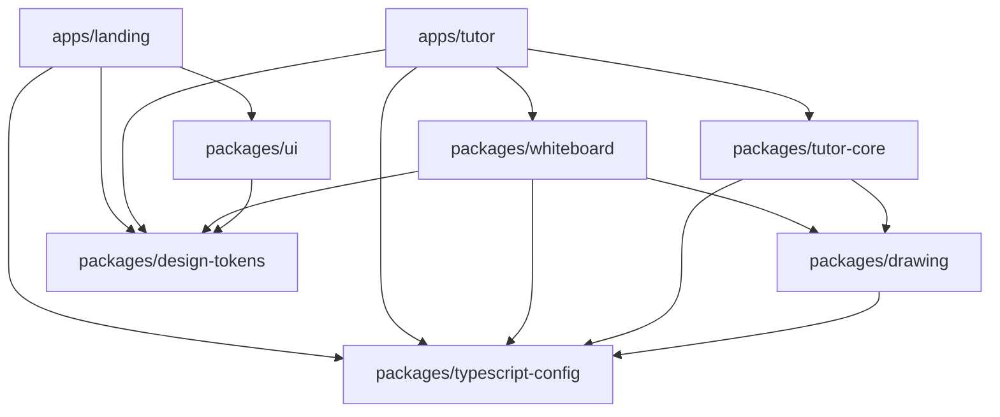

# Turborepo Monorepo Migration Plan

> **Repo:** `/home/kaizen/heytutor`  
> **Date:** 2026-06-22  
> **Goal:** Convert the current flat repo + nested `landing/` app into a **pnpm + Turborepo** monorepo that supports SaaS growth (marketing site, tutor app, shared packages, CI caching).

---

## 1. Current State

### What exists today

```
heytutor/                          # single repo, NOT a workspace yet
├── app/                           # Next.js 15 tutor app (product)
├── components/
├── lib/                           # tutor engine (LLM, TTS, whiteboard logic)
├── server.ts                      # custom Next server + WS TTS relay
├── public/
├── package.json                   # pnpm, name: "heytutor"
├── pnpm-lock.yaml
├── tsconfig.json
│
├── landing/                       # separate Vite marketing site
│   ├── src/
│   ├── package.json               # npm (package-lock.json), name: "landing"
│   └── node_modules/              # isolated deps
│
├── docs/
└── .omo/plans/
```

### Pain points (why monorepo)

| Issue | Impact |
|-------|--------|
| `landing/` has its own `node_modules` + npm lockfile | Duplicate React/TS installs, version drift |
| Tutor logic lives only in root `lib/` | Landing can't reuse design tokens, copy, or embed demo |
| Root `tsconfig` includes `**/*` | Accidentally typechecks/unifies unrelated apps |
| No task orchestration | Can't `build` both apps with cache/affected in CI |
| SaaS roadmap needs more surfaces | Auth, billing, admin, docs, mobile web — needs structure now |

### Version drift to resolve

| Package | Root (tutor) | landing/ |
|---------|--------------|----------|
| React | 19.2.4 | 19.2.6 |
| TypeScript | ^5 | ~6.0.2 |
| Tailwind | v4 | v3.4 |
| Package manager | pnpm | npm |

**Decision:** Standardize on **pnpm@10** + **Turborepo** at root. Align React/TS versions in Phase 1; unify Tailwind in Phase 3 (optional).

---

## 2. Target Architecture

### Directory layout (end state)

```
heytutor/
├── apps/
│   ├── tutor/                     # Next.js product app (current root app)
│   │   ├── app/
│   │   ├── components/            # app-specific UI shell only
│   │   ├── server.ts
│   │   ├── next.config.ts
│   │   └── package.json           # @heytutor/tutor
│   │
│   └── landing/                   # Vite marketing site (move from /landing)
│       ├── src/
│       ├── vite.config.ts
│       └── package.json           # @heytutor/landing
│
├── packages/
│   ├── design-tokens/             # DS colors, canvas sizes, CSS vars
│   │   └── package.json           # @heytutor/design-tokens
│   │
│   ├── drawing/                   # protocol, parser, shape paths, handwriting
│   │   └── package.json           # @heytutor/drawing
│   │
│   ├── tutor-core/                # LLM, TTS clients, audio sync, system prompt
│   │   └── package.json           # @heytutor/tutor-core
│   │
│   ├── whiteboard/                # Konva Whiteboard + cursor components
│   │   └── package.json           # @heytutor/whiteboard
│   │
│   ├── ui/                        # shared marketing + app primitives (optional)
│   │   └── package.json           # @heytutor/ui
│   │
│   ├── typescript-config/         # shared tsconfigs
│   │   └── package.json           # @heytutor/typescript-config
│   │
│   └── eslint-config/             # shared lint rules
│       └── package.json           # @heytutor/eslint-config
│
├── docs/                          # product/marketing docs (unchanged)
├── turbo.json
├── pnpm-workspace.yaml
├── package.json                   # root: turbo scripts only
├── pnpm-lock.yaml
└── .github/workflows/ci.yml
```

### Dependency graph



---

## 3. Package Boundaries

### `apps/tutor` — product app

**Owns:**
- Next.js routes (`app/`)
- API proxies (`/api/chat`, `/api/tts`, `/api/tts/stream`)
- `server.ts` (custom server + WebSocket relay)
- Page shell (`app/page.tsx`, layout, globals.css)
- App-only components: `InputBar`, `ResponseBubble` (or move to `@heytutor/ui` later)

**Imports from packages:**
- `@heytutor/tutor-core` — `streamLLMResponse`, `createTTSClient`, `TUTOR_SYSTEM_PROMPT`, `IncrementalTagParser`
- `@heytutor/whiteboard` — `Whiteboard`, shape execution helpers
- `@heytutor/design-tokens` — `DS`

**Env vars (app-local):**
```env
FIREWORKS_API_KEY=
FIREWORKS_MODEL=
ELEVENLABS_API_KEY=
ELEVENLABS_VOICE_ID=
ELEVENLABS_MODEL=
PORT=3000
```

---

### `apps/landing` — marketing site

**Owns:**
- Vite + React SPA
- Hero, pricing, FAQ, CTA sections
- Static deploy target (Vercel/Cloudflare Pages)

**Imports from packages:**
- `@heytutor/design-tokens` — brand colors, typography tokens for consistent SaaS look
- `@heytutor/ui` (later) — Button, Section, Navbar shared with tutor shell

**Future:** embed live demo via `@heytutor/whiteboard` in an iframe or lazy-loaded island pointing at `apps/tutor`.

---

### `packages/design-tokens`

Extract from `lib/designTokens.ts` + CSS vars in `app/globals.css`.

```typescript
// packages/design-tokens/src/index.ts
export const DS = { Colors: { ... }, Canvas: { ... } };
export const cssVariables = `:root { --wb-accent-amber: ... }`;
```

**Consumers:** tutor, landing, whiteboard, ui  
**Build:** `tsup` or plain `tsc` → `dist/`  
**No React dependency**

---

### `packages/drawing`

Extract:
- `drawingProtocol.ts`
- `incrementalParser.ts`
- `shapePaths.ts`
- `handwriting.ts`
- `strokeAnimation.ts`
- `cursorAnimation.ts`

**Dependencies:** `opentype.js` (optional peer for handwriting)  
**No React, no Next.js**

---

### `packages/tutor-core`

Extract:
- `llmAPI.ts`
- `elevenLabsClient.ts`
- `elevenLabsWebSocketClient.ts`
- `createTTSClient.ts`
- `audioSync.ts`
- `sentenceChunker.ts`
- `systemPrompt.ts`
- `mockResponses.ts`

**Dependencies:** none on React (browser APIs only)  
**Peer:** used by tutor app in client components

---

### `packages/whiteboard`

Extract:
- `Whiteboard.tsx`
- `VirtualCursor.tsx`
- `SpeakingWaveform.tsx`
- `ThinkingSpinner.tsx`

**Dependencies:** `react`, `react-konva`, `konva`, `gsap`, `@heytutor/drawing`, `@heytutor/design-tokens`

---

### `packages/typescript-config`

```
packages/typescript-config/
├── base.json
├── nextjs.json
├── react-library.json
└── package.json
```

---

### `packages/eslint-config`

Shared ESLint flat config consumed by both apps and packages.

---

## 4. Root Configuration

### `pnpm-workspace.yaml`

```yaml
packages:
  - "apps/*"
  - "packages/*"
```

### Root `package.json`

```json
{
  "name": "heytutor",
  "private": true,
  "scripts": {
    "dev": "turbo run dev",
    "dev:tutor": "turbo run dev --filter=@heytutor/tutor",
    "dev:landing": "turbo run dev --filter=@heytutor/landing",
    "build": "turbo run build",
    "lint": "turbo run lint",
    "typecheck": "turbo run typecheck",
    "clean": "turbo run clean && rm -rf node_modules"
  },
  "devDependencies": {
    "turbo": "^2.5.0",
    "typescript": "^5.8.0"
  },
  "packageManager": "pnpm@10.32.0"
}
```

> **Rule:** Root scripts only delegate via `turbo run`. No build logic at root.

### `turbo.json`

```json
{
  "$schema": "https://turbo.build/schema.json",
  "globalDependencies": ["**/.env.*local"],
  "tasks": {
    "build": {
      "dependsOn": ["^build"],
      "outputs": ["dist/**", ".next/**", "!.next/cache/**"]
    },
    "typecheck": {
      "dependsOn": ["^build"]
    },
    "lint": {
      "dependsOn": ["^build"]
    },
    "dev": {
      "cache": false,
      "persistent": true
    },
    "clean": {
      "cache": false
    }
  }
}
```

### Package naming convention

| Scope | Example |
|-------|---------|
| Apps | `@heytutor/tutor`, `@heytutor/landing` |
| Packages | `@heytutor/design-tokens`, `@heytutor/drawing`, … |

Use `workspace:*` for internal deps in each `package.json`:

```json
"dependencies": {
  "@heytutor/design-tokens": "workspace:*"
}
```

---

## 5. Migration Phases

### Phase 0 — Scaffold (no code moves yet)

**Goal:** Monorepo skeleton works with empty turbo pipeline.

1. Create `apps/tutor/` and `apps/landing/` directories
2. Add root `pnpm-workspace.yaml`, `turbo.json`, update root `package.json`
3. Install `turbo` at root
4. Move current root app files → `apps/tutor/` (git mv)
5. Move `landing/` → `apps/landing/` (git mv)
6. Delete `landing/package-lock.json`, `landing/node_modules`
7. Run `pnpm install` from root
8. Fix paths: `apps/tutor/tsconfig.json` with `"@/*": ["./*"]`
9. Verify:
   - `pnpm --filter @heytutor/tutor dev`
   - `pnpm --filter @heytutor/landing dev`
10. Update `.gitignore`:
    ```
    **/node_modules
    **/.next
    **/dist
    .turbo
    ```

**Exit criteria:** Both apps run independently from monorepo root with one lockfile.

---

### Phase 1 — Shared config packages

**Goal:** DRY tooling without touching product logic.

1. Create `packages/typescript-config`
2. Create `packages/eslint-config`
3. Point `apps/tutor` and `apps/landing` at shared configs
4. Align versions:
   - React → `19.2.4` (or latest 19.x, same everywhere)
   - TypeScript → `^5.8` everywhere (don't jump landing to TS 6 yet)
5. Add `typecheck` script to each package
6. Register `typecheck` in `turbo.json`

**Exit criteria:** `pnpm typecheck` passes for both apps.

---

### Phase 2 — Extract `@heytutor/design-tokens`

**Goal:** Landing and tutor share brand colors.

1. Move `lib/designTokens.ts` → `packages/design-tokens/src/index.ts`
2. Extract CSS variable map to `packages/design-tokens/src/css.ts`
3. Add `tsup` build → `dist/index.js` + `dist/index.d.ts`
4. Update `apps/tutor/app/globals.css` to import tokens or duplicate vars from package export
5. Update `apps/landing` Tailwind config to read token values
6. Replace imports: `@/lib/designTokens` → `@heytutor/design-tokens`

**Exit criteria:** Both apps render with same color palette; package builds in CI.

---

### Phase 3 — Extract `@heytutor/drawing` + `@heytutor/tutor-core`

**Goal:** Isolate pure logic from Next.js app.

1. Move drawing files → `packages/drawing`
2. Move TTS/LLM/sync files → `packages/tutor-core`
3. Set `"exports"` in each package.json:
   ```json
   "exports": {
     ".": {
       "types": "./dist/index.d.ts",
       "default": "./dist/index.js"
     }
   }
   ```
4. Configure `transpilePackages` in `apps/tutor/next.config.ts`:
   ```typescript
   const nextConfig = {
     transpilePackages: [
       "@heytutor/drawing",
       "@heytutor/tutor-core",
       "@heytutor/design-tokens",
     ],
   };
   ```
5. Delete moved files from `apps/tutor/lib/`

**Exit criteria:** Tutor app works identically; packages build with `^build` dependency chain.

---

### Phase 4 — Extract `@heytutor/whiteboard`

**Goal:** Reusable canvas for tutor app + future landing demo.

1. Move whiteboard components → `packages/whiteboard`
2. Add React as peerDependency
3. Export `Whiteboard`, handles, cursor components
4. Update `apps/tutor/app/page.tsx` imports
5. (Optional) Add Storybook or Ladle in `packages/whiteboard` for isolated dev

**Exit criteria:** Tutor whiteboard unchanged; package consumable from landing later.

---

### Phase 5 — Dev ergonomics + deploy

**Goal:** One-command dev and clear deploy paths.

#### Local dev options

| Command | What runs |
|---------|-----------|
| `pnpm dev` | Both apps (turbo parallel persistent) |
| `pnpm dev:tutor` | Tutor only (port 3000) |
| `pnpm dev:landing` | Landing only (port 5173) |

**Tutor custom server:** Keep `server.ts` in `apps/tutor`. Script:

```json
"dev": "tsx server.ts",
"dev:next": "next dev"
```

**Landing proxy (optional):** Vite dev proxy to tutor for demo CTAs:

```typescript
// apps/landing/vite.config.ts
server: {
  proxy: {
    "/app": "http://localhost:3000",
  },
}
```

#### Deploy mapping

| App | Platform | Domain |
|-----|----------|--------|
| `@heytutor/landing` | Vercel / Cloudflare Pages | `heytutor.com` |
| `@heytutor/tutor` | Vercel (Node server) | `app.heytutor.com` |

Turborepo + Vercel: set **Root Directory** per project (`apps/landing`, `apps/tutor`) or use `vercel.json` in each app.

---

### Phase 6 — CI + remote cache

**Goal:** Fast PR checks, affected-only builds.

`.github/workflows/ci.yml`:

```yaml
name: CI
on: [push, pull_request]

jobs:
  build:
    runs-on: ubuntu-latest
    steps:
      - uses: actions/checkout@v4
      - uses: pnpm/action-setup@v4
      - uses: actions/setup-node@v4
        with:
          node-version: 20
          cache: pnpm
      - run: pnpm install --frozen-lockfile
      - run: pnpm turbo run lint typecheck build --affected
```

Optional: Turborepo Remote Cache (Vercel or self-hosted).

**Exit criteria:** PR only rebuilds changed packages.

---

### Phase 7 — Future SaaS packages (post-monorepo)

Not part of initial migration, but structure supports:

| Future package / app | Purpose |
|---------------------|---------|
| `apps/admin` | School/tutor dashboard |
| `packages/auth` | Better Auth / Clerk wrapper |
| `packages/billing` | Stripe subscription logic |
| `packages/db` | Drizzle schema + client |
| `packages/analytics` | PostHog / Plausible events |
| `apps/docs` | Fumadocs or Mintlify docs site |

---

## 6. File Move Map (Phase 0–4)

| Current path | Target |
|--------------|--------|
| `app/` | `apps/tutor/app/` |
| `components/` | `apps/tutor/components/` → later split to `packages/whiteboard` |
| `lib/designTokens.ts` | `packages/design-tokens/src/index.ts` |
| `lib/drawingProtocol.ts` | `packages/drawing/src/` |
| `lib/incrementalParser.ts` | `packages/drawing/src/` |
| `lib/shapePaths.ts` | `packages/drawing/src/` |
| `lib/handwriting.ts` | `packages/drawing/src/` |
| `lib/strokeAnimation.ts` | `packages/drawing/src/` |
| `lib/cursorAnimation.ts` | `packages/drawing/src/` |
| `lib/llmAPI.ts` | `packages/tutor-core/src/` |
| `lib/elevenLabs*.ts` | `packages/tutor-core/src/` |
| `lib/createTTSClient.ts` | `packages/tutor-core/src/` |
| `lib/audioSync.ts` | `packages/tutor-core/src/` |
| `lib/sentenceChunker.ts` | `packages/tutor-core/src/` |
| `lib/systemPrompt.ts` | `packages/tutor-core/src/` |
| `lib/mockResponses.ts` | `packages/tutor-core/src/` |
| `components/Whiteboard.tsx` | `packages/whiteboard/src/` |
| `components/VirtualCursor.tsx` | `packages/whiteboard/src/` |
| `server.ts` | `apps/tutor/server.ts` |
| `public/` | `apps/tutor/public/` |
| `landing/*` | `apps/landing/*` |

**Keep at repo root:** `docs/`, `.omo/plans/`, `README.md`, `turbo.json`, `pnpm-workspace.yaml`

---

## 7. Key Technical Decisions

### 7.1 Next.js in monorepo

- Set `outputFileTracingRoot` if needed for standalone deploy
- Use `transpilePackages` for all `@heytutor/*` workspace packages
- Keep `server.ts` inside `apps/tutor` (WS relay is product-specific)
- Env files: `apps/tutor/.env.local` (not root)

### 7.2 Vite landing in monorepo

- Resolve workspace packages via Vite:
  ```typescript
  resolve: {
    alias: {
      "@heytutor/design-tokens": path.resolve(__dirname, "../../packages/design-tokens/src"),
    },
  },
  ```
  Or consume built `dist/` via `workspace:*` after `^build`.

- Prefer **source imports in dev** + **dist in CI** for faster local iteration.

### 7.3 Tailwind v3 vs v4

| App | Tailwind | Action |
|-----|----------|--------|
| tutor | v4 | Keep in Phase 0–5 |
| landing | v3 | Keep until landing redesign |

Unify to v4 in a later pass when landing is rebuilt to match tutor design system.

### 7.4 Package build tool

Use **`tsup`** for internal packages (fast, dual ESM/CJS, d.ts):

```json
"scripts": {
  "build": "tsup src/index.ts --format esm,cjs --dts",
  "dev": "tsup src/index.ts --watch"
}
```

Libraries without JSX: `design-tokens`, `drawing`, `tutor-core`  
Whiteboard package: `tsup` with `esbuild-plugin` or `tsc` + preserve JSX.

### 7.5 What NOT to extract yet

- `InputBar`, `ResponseBubble` — app shell, low reuse
- `mockResponses` — keep in tutor-core (demo/test utility)
- `.omo/` plans — stay at root
- API route handlers — stay in `apps/tutor` (Next.js bound)

---

## 8. Risks & Mitigations

| Risk | Mitigation |
|------|------------|
| Next.js can't resolve workspace packages | `transpilePackages` + proper `exports` fields |
| Custom `server.ts` breaks after move | Update `next` import paths; test WS relay |
| Landing npm lock conflicts | Delete `package-lock.json`; single pnpm lock |
| Long migration breaks main branch | One phase per PR; keep tutor deployable after each phase |
| Konva/opentype in SSR | Keep whiteboard as `"use client"` only; no SSR in package |
| Turbo cache stale after package extract | Bump package version or clear `.turbo` once |

---

## 9. PR Sequence (recommended)

| PR | Scope | Risk |
|----|-------|------|
| **PR 1** | Phase 0: scaffold + move apps, no package extraction | Medium |
| **PR 2** | Phase 1: shared tsconfig + eslint | Low |
| **PR 3** | Phase 2: `@heytutor/design-tokens` | Low |
| **PR 4** | Phase 3: `@heytutor/drawing` + `@heytutor/tutor-core` | High |
| **PR 5** | Phase 4: `@heytutor/whiteboard` | Medium |
| **PR 6** | Phase 5–6: dev scripts, Vercel config, CI | Low |

Each PR must pass: `pnpm turbo run lint typecheck build --filter=...[affected]`

---

## 10. Verification Checklist

After full migration:

- [ ] `pnpm install` from root — single lockfile, no nested `node_modules` in apps
- [ ] `pnpm dev:tutor` — whiteboard tutor works, WS TTS relay on `:3000`
- [ ] `pnpm dev:landing` — marketing site on `:5173`
- [ ] `pnpm build` — builds all packages then apps in dependency order
- [ ] `pnpm turbo run build --filter=@heytutor/tutor` — cache hit on unchanged packages
- [ ] Mock mode works without API keys
- [ ] Env vars load from `apps/tutor/.env.local`
- [ ] No `@/` imports crossing app boundaries (only `@heytutor/*`)
- [ ] CI runs `--affected` on pull requests

---

## 11. Commands Cheat Sheet (post-migration)

```bash
# Install everything
pnpm install

# Dev
pnpm dev:tutor
pnpm dev:landing
pnpm dev                    # both via turbo

# Build
pnpm build
pnpm turbo run build --filter=@heytutor/landing

# Affected (local)
pnpm turbo run build --affected

# Clean
pnpm turbo run clean
rm -rf .turbo **/node_modules && pnpm install
```

---

## 12. Summary

| Before | After |
|--------|-------|
| 1 Next app at root + 1 nested npm Vite app | 2 apps under `apps/` |
| Shared logic trapped in `lib/` | 4–6 focused packages under `packages/` |
| Manual dev for each app | `turbo run` with cache + `--filter` |
| Landing can't share tutor code | Tokens → UI → whiteboard demo path |
| No CI task graph | Turborepo affected builds on every PR |

**Recommended start:** Phase 0 only (scaffold + move, no extraction). Ship that first, then extract packages incrementally so the tutor app never breaks for more than one PR at a time.
