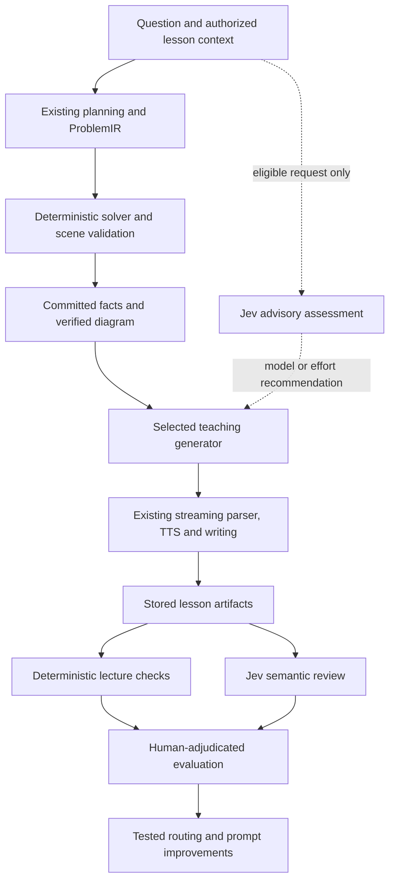

# Jev in Accelute: integration and cost plan

Research date: 22 September 2026. Implementation of the first increment landed 23 September 2026. Priorities: cost, responsiveness, and teaching quality together.

**First increment, now in the tree:** cost accounting records cache hits and treats missing usage as unknown; Jev is priced on its own lane; an offline lecture-lab assessor can flag lessons without approving them; notes chat can try a cheaper model only when `TUTOR_NOTES_EVALUATION_MODE` is set. The default notes path and the spoken lesson are unchanged. Planner concurrency, voice, and live teaching routing are still later work.

**Recommendation: introduce Jev as a bounded evaluator, first in the lecture lab, then for choosing teaching models on a narrowly tested subset of requests. Pair this with cost instrumentation, smaller notes context, selective planner concurrency, and voice evaluation. Keep deterministic mathematical and diagram authority intact.**

Jev alone does not make lessons cheaper: it adds a request. Savings happen when its decisions allow Accelute to avoid unnecessary generation or use a less expensive generator without reducing lesson quality. Some improvements below need no Jev at all.

The external model/API investigation is captured in the [dated source review](../snapshots/jev-model-source-review-2026-09-22.md). This plan connects that research to the implementation.

## What was examined, and what remains unknown

Reviewed the live question handler, turn and scene planners, ProblemIR/solver integration, Fireworks model selection and transports, notes chat, OCR, title generation, TTS defaults and replay, billing/cost accounting, lecture-lab grading, saved local lab summaries, and documented figure failures. Sources below link to the code that establishes each finding.

No private environment values, production database records, provider invoices, or live student transcripts were fetched. No paid model calls or new lecture runs were made. Production model overrides, traffic mix, cache hit rate, cancellation charges, and monthly spend remain unknown. The user does not know current spending; all financial projections here are explicit scenarios.

## Jev's actual role

Jev evaluates supplied state using typed questions and returns choices, scores, and boolean probabilities. It does not generate the free-form explanation, scene document, source-grounded ProblemIR, or audio that Accelute needs. Vercel lists a 32K context window and a free promotion ending **25 September 2026**. Do not build the business case around permanent free inference. [Vercel model listing](https://vercel.com/ai-gateway/models/jev).

Use the documented HTTP evaluation endpoint from the existing EC2 server. That avoids adopting a new chat SDK for this experiment. Jev is not compatible with the current Fireworks chat-completions transport. The alternative AI SDK integration uses an experimental evaluation interface. Exact API details, version constraints, provider pricing, and limitations are in the source review. [Gateway evaluation documentation](https://vercel.com/docs/ai-gateway/modalities/evaluation).

Treat probabilities as predictions to calibrate against Accelute examples, never mathematical proof or established confidence on JEE/DSA/Hindi tasks. A text evaluation can flag semantic mismatches in a scene description; it cannot inspect canvas overlap, listen to pronunciation, or measure actual voice/pen synchronization.

## Current architecture and spending opportunities

| Lane | Actual implementation | Implication |
|---|---|---|
| Turn planning | `planTurnV3` launches two Kimi lanes concurrently, waits up to 3 seconds after the first valid plan for a peer, and selects using deterministic rules. | Two generation requests are started even for easy new questions. Their contribution to correctness and tail latency must be measured before reducing them. |
| Problem formulation | DeepSeek V4.1 Flash builds ProblemIR; a deterministic solver validates and computes supported results. | Already an inexpensive specialized lane. Preserve independent source grounding and solver checks. |
| Exact scene planning | Two initial candidates; when invalid, up to two repair rounds with two candidates each; 750 ms grace after a valid candidate. | Potentially six scene requests within the shared deadline, before transport retries. Jev is not a replacement for any document generator. |
| Teaching | Kimi K3, or its Fast router. Planned teaching disables thinking. Normal budget 3,600 output tokens; DSA budget 12,000; the turn loop permits up to two continuations. | A cheaper narrator may help, but must preserve equations, teaching completeness, streaming tags, and first spoken word latency. |
| Notes chat | Explicit `fastMode: true`; Kimi Fast by default; up to 1,200 output tokens, 12 chat-history messages, and all assembled board notes. | Strong first target for cheaper generation and relevant context selection; no new diagram or voice synchronization to manage. |
| Voice | Natural voice default: ElevenLabs Multilingual v2. Flash v2.5 is already a supported user setting. | A potentially larger total-cost opportunity than changing narration models. |
| OCR | A separate Qwen vision lane. | Jev cannot read the uploaded photo. Text-only checks can flag incomplete extraction for review, not certify fidelity to the image. |
| Board titles | Generic planner model, up to 512 tokens, with an existing deterministic fallback title. | Small avoidable call; use the fallback or benchmark a cheap generator. Jev cannot write a new title. |
| Replay/recovery | Stored audio playback, TTS prefetch, and board-scoped exact-question scene recovery already exist. | Extend and measure these paths instead of proposing them as missing features. |

Evidence: [turn planner](../../packages/tutor-core/src/planners/turnPlannerV3.ts), [scene planner](../../packages/tutor-core/src/planners/scenePlannerV2.ts), [problem planner](../../packages/tutor-core/src/planners/problemPlannerV1.ts), [model defaults](../../apps/tutor/lib/llm/fireworksModels.ts), [teaching transport](../../apps/tutor/lib/llm/teachingTransport.ts), [notes route](../../apps/tutor/app/api/boards/[boardId]/notes-chat/route.ts), [notes serialization](../../apps/tutor/features/tutor-session/lib/notes/lessonNotes.ts), [settings defaults](../../apps/tutor/lib/account/lessonSettings.ts), [voice proxy](../../apps/tutor/lib/tts/ttsProxy.ts), [title route](../../apps/tutor/app/api/board-name/route.ts), [scene recovery](../../apps/tutor/features/tutor-session/lib/scene/verifiedSceneRecovery.ts).

A visual new question ordinarily starts **six generation requests**: two turn plans, one ProblemIR, two scenes, and one teaching stream. That is a request count, not six guaranteed fully billed completions: losers can be cancelled; actual billed work needs provider reconciliation. Repairs, transport retries, titles, photos, and continuations add work. Chemistry, DSA, recovered scenes, and questions without visuals have different paths.

The [live handler](../../apps/tutor/features/tutor-session/hooks/turn/useQuestionHandler.ts) already skips fresh planning for explicit doubts and resumes. Chemistry already bypasses LLM scene planning. A second turn-plan audit was previously removed from the live path because it added latency. Do not claim savings from removing these again, or reintroduce an unconditional Jev audit before every spoken answer.

### Quality evidence already available

The saved local `apps/tutor/.lecture-lab/chem-round-03/summary.json` contains 15 ad hoc chemistry questions: 15 passed the stored rubric, mean score 77, no transport failures. Recomputed from its grade metrics: median planning 17.019 seconds, nearest-rank p95 39.437 seconds; median teaching generation 8.601 seconds. The summary flags late row cues in 15 lessons, unspoken row cues in 10, and late focus placement in 6.

This is historical development evidence, not today's production benchmark. The files were last modified on September 11; modification time does not establish generation time or model identity. The lab omits live TTS and browser playback, so these timings do not measure time to first audio or actual pen/audio drift. Fifteen cases are too few for a stable p95. The stored rubric itself needs review: other saved rounds include arithmetic flags that appear to misread alternative solutions.

The existing [lecture rubric](../../apps/tutor/scripts/lecture-lab/grade.ts) explicitly leaves physics correctness and teaching clarity to reviewers. The [figure investigation](figure-relevance-fixes.md) records historical cases where a structurally acceptable figure depicted the wrong problem. Several fixes subsequently landed; the old counts are useful regression examples, not an estimate of current failure prevalence.

This establishes two distinct jobs: preserve deterministic structural checks, and add semantic assessment with human adjudication. Jev is a candidate for the latter.

## Ranked Jev applications

### 1. Offline lesson assessment — implement first

Add an optional assessment pass over stored lecture artifacts. Supply the original question, requested outputs, solver-backed facts, relevant narration/work rows, and a compact scene/DSA-trace description. Batch a few related questions against that shared state:

- Does the explanation address every requested part?
- Does it contradict the supplied authoritative facts?
- Is the figure description relevant to the physical setup or algorithm being taught?
- Does the explanation connect each important equation to its purpose?
- Does it repeat material without advancing the solution?

Use explicit `insufficient_evidence`/`not_applicable` choices where appropriate. Keep completeness separate from correctness; a polished but wrong explanation must not earn an aggregate passing score. Keep deterministic arithmetic, forbidden-ink, reference, and frame-coverage checks outside Jev.

Store results separately from `LectureGrade`. Initially Jev flags review candidates; it cannot overturn a deterministic failure or approve a release. Ask humans to review both flagged examples and a random sample of unflagged examples, otherwise false negatives remain invisible. For explanations of a flagged result, open the actual artifact or use a separate reviewer; do not assume Jev returns free-form rationales or evidence spans.

Expected benefit: broader, cheaper review coverage and better model comparisons. **No immediate inference savings**: the current rubric is local code, and there is no always-on paid semantic judge here to replace.

### 2. Notes-chat model and context selection — first live experiment

Start by giving notes chat its own model configuration. It currently inherits teaching and forces Fast serving. Pilot the already integrated DeepSeek V4.1 Flash as a generator against Kimi Fast. Availability in the ProblemIR lane does not establish its teaching quality or compatibility with every notes payload.

Use explicit tagged rows/turns first to select context deterministically. Include necessary definitions, givens, units, and authoritative facts. The present whole-board serialization has no explicit overall token budget; 12 chat messages does not bound the accumulated notes. On untagged ambiguous questions, Jev can choose a bounded set of relevant turn IDs or an `unknown` option. Preserve original source text; do not replace quantities with a model-written summary. Measure whether selection plus evaluation is actually cheaper than simply sending a compact context.

Possible generator policy: straightforward explanation of already supplied material → tested cheaper generator; new derivation, contradictory premises, incomplete context, or evaluator uncertainty → existing Kimi behavior. A Jev label can influence model choice but cannot authorize board access or declare an answer correct.

Begin with a static cheaper-model cohort as a baseline. If that achieves the same quality as Jev routing, keep the simpler policy. Later routing is justified only by a measured improvement in quality, cost, or latency.

### 3. Adaptive narration — after notes-chat and offline assessment work

Choose teaching effort from explicit user preferences, known lesson state, verified content, and optional Jev assessment. Examples: answer a localized doubt briefly, explain an unfamiliar concept with a worked step, or use the stronger narrator when the question asks for a new proof.

Do not infer mastery from one score or shorten a lesson just to improve cost. Success means the requested reasoning and learning objective were delivered. For DSA, all promised code blocks, examples, and trace frames must still appear.

Route once before a teaching stream starts. Preserve current `[STEP]`, `WRITE`, `FOCUS`, and code-lesson contracts. If the cheap generator fails before emitting content, allow a bounded fallback. After content or audio has been emitted, use the existing continuation/resume mechanism; replaying a second answer from the beginning can duplicate speech and ink.

Start with notes and localized doubts. Full solved STEM narration follows only after protocol and pedagogy validation; DSA is a separate cohort. Do not move every lane to one cheap model simultaneously.

### 4. Planning effort and scene relevance — later, with tighter limits

First benchmark deterministic improvements: on requests with complete supported solver coverage, try one planner candidate with a delayed second request if the first is slow or inadequate. Separately test attempting a complete engine-built scene before asking an LLM for scene candidates. These require full scene validation and requested-output coverage; a family representation is not automatically equivalent to an exact solution.

Jev can eventually provide an advisory risk signal for spending more planner effort or prioritize semantically suspicious scenes for review. It must not select diagram families as a new topic router, suppress required visuals, skip ProblemIR, replace proof checks, or repair coordinates. A live semantic veto would require its own false-rejection evaluation and an independently valid fallback; keep it offline initially.

Two speculative generations may be essential to tail latency or unsupported numeric reasoning. Retain current behavior for unsupported solvers, multiple requested outputs, ambiguity, and evidence of peer disagreement until the relevant cohort passes evaluation. Measure attempt count and billed cancellation waste rather than assuming the losing request costs nothing.

### 5. Future student practice — useful but not the cost-first rollout

After the first four stages, test classification of misconception type or next instructional action against a supplied worked solution. Deterministic answer checks should handle supported numerical answers; Jev can distinguish a sign-convention issue from a conceptual misunderstanding. A teacher generator writes the feedback. Validate multilingual performance and avoid treating the classifier's assessment as a durable learner label.

## Integration design

Keep the tutor on EC2. Add a small server-owned evaluation module under `apps/tutor/lib/llm/evaluation/`; no browser keys, deployment migration, or rewrite of the streaming chat stack is necessary.



Proposed interface (application contract, not a vendor SDK type):

```ts
assessTutorState(request, { signal })
  -> { status: "assessed", assessment, provenance, usage }
   | { status: "unavailable", reason }
```

`request` is a discriminated union of supported jobs, initially `lesson_review` and later `notes_routing`. The module owns state budgets, versioned rubrics, vendor request/response validation, deadline handling, cost capture, and fallback classification. Keep policy mapping beside model selection, so an evaluator score is visibly different from authorization or mathematical authority.

The initial adapter uses `POST https://ai-gateway.vercel.sh/v1/evaluate`, server-side `AI_GATEWAY_API_KEY`, and model `typesafe-ai/jev`. Request fields include `state` and `questions`; response usage uses `inputTokens`/`outputTokens`, and Gateway returns routing/cost metadata. Do not feed that response through the Fireworks SSE usage parser. [HTTP contract](https://vercel.com/docs/ai-gateway/modalities/evaluation#http-api).

Implementation requirements:

1. Server-controlled rubrics, model IDs, and allowed decisions. Treat student text as data. Never expose an unauthenticated generic evaluator endpoint or trust a client-supplied cheap-route/authority flag.
2. Apply existing board ownership, usage grants, cancellation, and request-size checks to any live entry point. The initial offline runner needs no public route.
3. Normalize and validate every typed answer: finite probabilities in range, allowed choices, expected question keys, and score scale. Missing/invalid answers become unavailable, never a positive approval.
4. Keep Gateway provenance, model alias, rubric version, input hash, policy version, latency, and billed usage. Detect alias changes and re-evaluate quality; a stable alias is not proof of fixed weights.
5. Use a short online deadline, initially a proposed 300 ms budget subject to EC2 measurements, no synchronous retry, and a circuit breaker. On timeout, missing key, 429, or schema drift, retain the existing model path. If that budget rarely succeeds, keep Jev offline instead of extending student wait time.
6. Avoid an extra serial request when independent work is available. Skip Jev entirely for deterministic explicit actions. Cache identical assessments only within an appropriate scope, keyed by complete relevant context plus model/rubric/policy versions.
7. For background review, persist pending jobs and run a bounded worker in the existing server deployment; use idempotency keys and capped retries. Do not create a new infrastructure stack just for this pilot, or depend on untracked promises surviving restarts.

Vercel documents TypeSafe support for ZDR and no training. Per-request ZDR is available on Pro/Enterprise without the team-wide per-request surcharge. Select and verify the required request policy; if the account cannot satisfy it, keep the pilot on synthetic/non-personal corpus data. TypeSafe's public under-18 personal-data wording warrants clarification for student-linked production data; it does not by itself establish a blanket ban on evaluating educational text. Keep identifiers, photos, audio, secrets, and unrelated conversation out of evaluation state. [Gateway ZDR](https://vercel.com/docs/ai-gateway/security-and-compliance/zdr), [TypeSafe privacy](https://typesafe.ai/legal/privacy-policy).

## Cost: measure the whole successful lesson

The production objective should be:

```text
cost per satisfactory lesson =
  (all generation + evaluation + speech + retries + wasted attempts)
  / lessons that complete and satisfy the teaching/accuracy criteria
```

Keep infrastructure, storage, egress, subscription commitments, and review labor visible separately. A successful replay is a separate workload from generating a new lesson.

### Rates and accounting findings

Fireworks currently lists Kimi K3 at $3 input / $15 output per million tokens, Fast at $4.50 / $22.50, and cached input at $0.30/$0.45 respectively. Its pricing table lists DeepSeek V4.1 Flash at $0.30/$1.20, but the model page lists $0.22/$0.66, matching this repository's defaults. **The primary sources conflict; reconcile against provider billing before changing student allowances.** [Pricing table](https://docs.fireworks.ai/serverless/pricing), [model page](https://app.fireworks.ai/models/fireworks/deepseek-v4p1-flash).

ElevenLabs lists Multilingual v2 at $0.10/1K characters and Flash/Turbo at $0.05/1K characters. These match the repository's estimates; actual effective cost depends on the account's plan. [ElevenLabs API pricing](https://elevenlabs.io/pricing/api).

The [cost calculator](../../apps/tutor/lib/obs/usageCost.ts) has no cached-input field. [Chat usage parsing](../../apps/tutor/app/api/chat/route.ts) retains prompt/completion totals only. [Billing tracking](../../apps/tutor/lib/billing/track.ts) uses those calculated amounts to consume the user's budget, while [run-cost aggregation](../../apps/tutor/lib/obs/runCost.ts) recalculates rates for observations. This is more than a dashboard issue.

Add separately recorded uncached input, cached input, output/reasoning where billed, generated speech characters, actual reported cost when available, rate version, and reconciliation status. Do not silently price Jev through the unknown-model fallback, which currently uses Kimi Fast rates. Keep quality-audit spending separate from student entitlements. The ledger rounds each spend to thousandths of a dollar; tiny evaluation calls require higher precision or aggregation if ever included, not per-call rounding to zero.

The title route does not call `recordLlmSpend`. Cancelled streams may not deliver a final usage event. Record unknown usage as unknown and reconcile against provider totals; never represent it as proved free. Updating estimates does not itself reduce the invoice.

### Reproducible scenario, not observed usage

Assume an eligible new visual lesson, no cache discount, no repairs or retries, and these completed generations:

| Stage | Count | Input/output tokens per call |
|---|---:|---:|
| Kimi Fast turn planner | 2 | 4,000 / 1,000 |
| DeepSeek ProblemIR | 1 | 4,000 / 1,500 |
| Kimi Fast scene planner | 2 | 6,000 / 2,000 |
| Kimi Fast teaching | 1 | 6,000 / 2,000 |
| Multilingual voice | 1 | 8,000 spoken characters |

Using both published DeepSeek price variants gives:

| Configuration | Approximate USD per eligible lesson | Meaning |
|---|---:|---|
| Baseline above | $1.099–$1.100 | Voice contributes $0.80. |
| Voice switched to Flash only | $0.699–$0.700 | About 36% total reduction, contingent on acceptable voice quality. |
| Teaching switched to DeepSeek + Jev only | $1.030–$1.032 | About 6% total reduction; voice and planning dominate. |
| One Fast turn plan + one Fast scene, DeepSeek teaching, Flash voice, Jev | $0.517–$0.520 | About 53% lower for this eligible case, before fallback costs. |

For Jev, the scenario reserves 6,000 total billed input tokens at the provider's published $0.042/M baseline: $0.000252. This is a sensitivity assumption, not a confirmed future Gateway invoice rate. Include rubric/question tokens and every assessment in measured usage. If using two requests, their combined billed input must fit that assumption. The free promotion is deliberately excluded from the calculation. [TypeSafe model pricing](https://docs.typesafe.ai/models).

At 10,000 identical eligible lessons, this scenario is about $11,000 versus $5,200 in variable AI/voice spend. **That is not an estimate of Accelute's monthly bill.** If only half of traffic qualifies and the remainder is unchanged, the illustrated overall reduction is about 26%, before retries. Cache-heavy, already-Flash, or shorter-voice traffic will have different savings.

For a separate notes example, 8K input/600 output costs $0.0495 on Kimi Fast. At the higher published DeepSeek rate plus a 2K-token Jev assessment, it is $0.003204, around 94% lower **on that request**, before escalation. This says nothing about equal answer quality. It explains why notes chat is a worthwhile first comparison.

General cheap-then-escalate break-even rule:

```text
C_new = C_jev + C_cheap + p_escalation * C_strong
beneficial when C_new < C_strong
```

That formula assumes both cheap and strong calls are paid on escalation. A router that selects one generator has a different expected cost. Measure false acceptances as well as spend; a low escalation rate is not success if bad answers escape.

### Improvements that need no Jev

- **Prompt reuse:** Fireworks already caches exact shared prefixes automatically. Keep stable instructions first, variable lesson context later, and measure cached tokens. Evaluate session affinity; do not claim enabling a feature that is already on. [Fireworks prompt caching](https://docs.fireworks.ai/guides/prompt-caching).
- **Relevant notes:** use selected rows/turns and a bounded context budget before adding model-based retrieval.
- **Voice:** A/B existing Flash against Natural for math terms, symbols, Hindi/Indian English, expressiveness, alignment availability, and actual first audio. Respect an explicit voice preference. Reuse stored audio, instrument discarded lookahead and fallback synthesis, and preserve estimated writing schedules.
- **Titles:** use the existing deterministic title where adequate; otherwise a dedicated cheap generator. Measure this small lane rather than optimizing it before voice/planning.
- **Validated reuse:** retain exact question/plan/engine-version and board isolation checks. Jev similarity is insufficient to reuse a diagram: changing a sign, unit, or value changes the problem.
- **Selective concurrency:** compare one candidate plus delayed escalation with the current race. Optimize completed quality and tail latency together, not just API request count.

## Evaluation and rollout

Use the existing `data/syllabus-probes`, `data/leetcode-probes`, curated bank cases, and authorized/sanitized failure examples. Include easy and hard questions, multi-part calculations, conceptual-only lessons, missing figures, chemistry, DSA, follow-ups, changing numbers, long boards, Hindi/English, and adversarial instructions embedded in question text.

Split by underlying problem/family or source, not just paraphrase, so calibration and held-out examples do not leak. Freeze rubrics and thresholds before held-out testing. Include contrast pairs: correct/incorrect sign, relevant/irrelevant apparatus, full/incomplete answer, valid alternate notation, and a good explanation phrased differently. Human reviewers adjudicate disagreements; Jev must not become the sole labeler of its own success.

Compare these arms separately:

1. Current system.
2. Current system + Jev review only, no changed decisions.
3. Static cheaper notes/narration policy without Jev.
4. Jev-selective cheaper generation.
5. Selected planner/voice changes, first individually and then combined.

Proposed acceptance criteria, to confirm against measured baseline:

| Dimension | Gate |
|---|---|
| Authority | No bypass of solver, scene validation, ownership, or persistence checks; no new severe mathematical/scene regressions in the held-out evaluation. |
| Pedagogy | Human-reviewed correctness/completeness meets a predeclared non-inferiority margin; also demonstrate improvement on at least one targeted weakness such as omitted reasoning or irrelevant explanation. |
| Jev calibration | Report false negatives, false positives, abstentions, and coverage per task/language. Do not select a universal 0.9 threshold without data. |
| Reliability | Track completion over all attempts, including transport failures; report the conditional quality pass rate separately. |
| Latency | Online assessment overhead p95 within the chosen budget; overall p95 first meaningful audio does not regress. Planner optimization must improve measured waiting time to justify itself. |
| Economics | At least 20% lower cost per satisfactory lesson/request in the eligible live cohort after evaluator, fallback, retry, and speech costs. This is a proposed gate, not promised savings. |
| Synchronization | Existing deterministic gates pass; browser recordings show no worse word/pen alignment, pauses, or premature frame changes. |

Start with roughly 200–300 diverse examples for rubric calibration, then a distinct held-out set large enough for the target error bound. For context, observing zero events in 300 independent cases still permits an approximately 1% upper 95% event rate; a small green suite cannot establish near-zero critical errors. Report uncertainty and clustered examples honestly.

### Concrete implementation sequence

| Phase | Deliverable and files | Release condition |
|---|---|---|
| 0: establish baseline | Update usage capture in `app/api/chat/route.ts`, `lib/obs/{usageCost,runCost}.ts`, and `lib/billing/track.ts`; audit notes/title accounting; snapshot provider rates and per-lane costs. | Account for known versus unknown spend; confirm invoice rates and current env-selected models without exposing secrets. |
| 1: offline Jev | `lib/llm/evaluation/`; optional `scripts/lecture-lab/assess.ts`; separate assessment artifact with rubric/model versions. | Calibration, held-out review, transport/schema tests, and a useful improvement over existing heuristics. |
| 2: notes pilot | Independent notes model selection in `lib/llm/`; bounded context in notes helpers/route; compare static cheap and Jev-selected cohorts. | Quality, cost, and first-token gates; graceful evaluator outage. |
| 3: teaching pilot | Policy seam before teaching in `useQuestionHandler.ts`; server-enforced model selection in `/api/chat`; common offline/live teaching policy. | Protocol, human teaching, first-audio, and browser sync checks. DSA remains a separate experiment. |
| 4: planner and voice | Configurable candidate effort in tutor-core; separately test existing voice choices; inspect lookahead waste. | No loss of authority/coverage, better full-lesson economics, and no latency regression. |
| 5: adaptive practice | Misconception/next-action assessment with validated feedback generation. | Evidence of improved learning/next-question performance, not just model scores. |

Roll out shadow assessments first, then stable randomized 5% and 25% eligible cohorts, with concurrent controls and automatic rollback on critical errors or latency degradation. Ramp only after enough representative traffic, not merely after a fixed number of days. Suggested flags: `TUTOR_EVALUATION_MODE=off|shadow|enforce`, independent per-use-case rollout, and rubric/policy version. A kill switch restores current routing immediately.

Before modifying scene-engine synthesis/document/capability/verification code, follow the repository's session-ownership protocol. The first three phases can largely avoid those areas.

Implementation validation should cover provider contract failures, timeout/cancellation, wrong/missing types, prompt injection, context leakage, exact reuse keys, usage precision, and stream fallback. Run the existing tutor-core/tutor and relevant scene gates plus typecheck/lint/build for code changes. Model benchmarks and browser playback are separate from unit verification; do not run package builds while a live lecture-lab round is in flight.

## Decision

Proceed with **measurement + offline Jev assessment + a notes-chat model/context experiment** as the first increment. It is small enough to isolate value, uses an existing evaluation harness, and creates the evidence needed to improve the more expensive live tutor safely.

The broader opportunity is a tutor that spends computation according to validated need: deterministic systems establish facts and figures, suitable generators explain them, and measured assessment helps choose effort and find teaching failures. Jev may be a useful part of that system; it should earn each production responsibility through Accelute-specific evidence.
