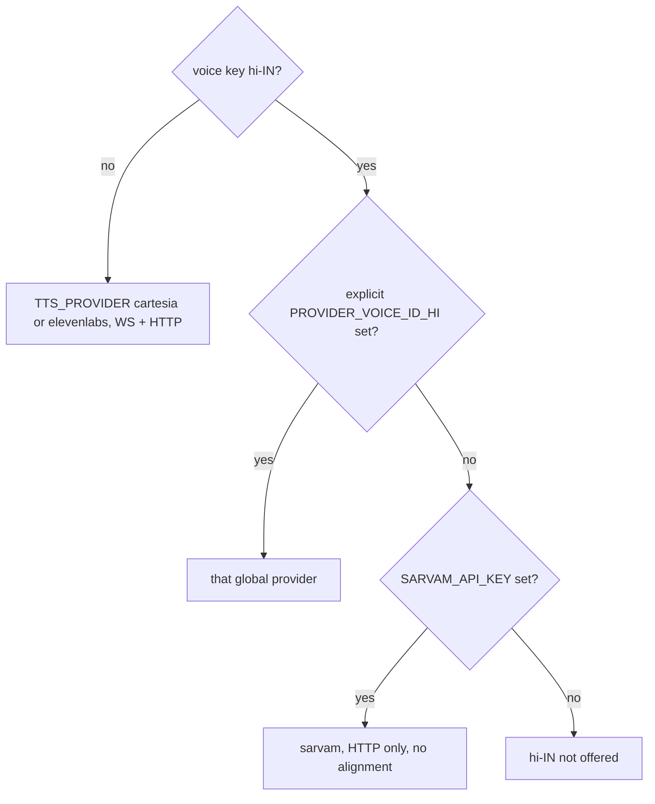

# Sarvam Hinglish Voice

Status: shipped on branch `sarvam-hinglish-voice` (6 Oct 2026). What changed from
this plan, all measured against the live Sarvam API:

- Subtitles are mixed script, not Roman. Sarvam's docs say Hindi in Latin
  letters "significantly degrades output quality", so the narration is Hindi in
  Devanagari and English in Latin, and the subtitle shows exactly what is spoken.
- Hindi uses the WebSocket relay, not HTTP only. Sarvam now streams
  (`wss://api.sarvam.ai/text-to-speech/ws`): first audio in about 350 ms, one
  `final` per flush, raw 24 kHz PCM wrapped in the same WAV as Cartesia. The
  relay sends one sentence at a time (Sarvam has no context ids) and pings every
  25 s (Sarvam closes after a minute idle). HTTP is the fallback.
- Digits are spoken as English words. Sarvam reads "9" as नौ; the pen matches
  rows by English number words. The prompt asks for words and the server
  converts any leftover digit before Sarvam (`sarvamSpeechText`).
- The setting is `audioLanguage: "hinglish"`. Legacy `"hindi"` rows (an English
  lesson in a Hindi accent) are no longer recognised and read as English, so no
  data migration was needed.
- No timings: the pen keeps its estimated schedule; the WAV header length feeds
  the speech-rate learner and the saved sentence duration for replay and export.

Gates: `verify-sarvam-tts`, `verify-hinglish-lesson`, plus the rewritten
`verify-voice-language` and `verify-settings-persist`. Live probe:
`scripts/live/probe-sarvam-voices.mjs`. Lecture lab: `--narration hinglish`.

The rest of this file is the original plan, kept for its reasoning.
Scope: Hinglish voice + subtitles for the tutor app. Board ink unchanged.

## Intent

A casual Hinglish teaching voice and subtitles. Hindi-English mix, the way a
friendly tutor in India speaks, slang included. Selecting it changes the voice
and the spoken text. Board ink, the planner, and `[WRITE]` rows stay in English.

## Decisions

1. **Route by voice key.** Add `ttsProviderFor(voiceKey, env)` in
   `apps/tutor/lib/tts/providerConfig.ts`. `speechProvider()` stays the English
   vendor selector: it still defaults to Cartesia and still throws on an
   unknown `TTS_PROVIDER` (`providerConfig.ts` lines 29–38). `SpeechProvider`
   gains `"sarvam"`. `TTS_PROVIDER=sarvam` stays invalid.
2. **Hindi is HTTP-only in v1.** The client never opens a socket for `hi-IN`.
   The server WebSocket upgrade rejects a Sarvam-routed `hi-IN` as a second
   guard. Lookahead is the existing HTTP prefetch (`MAX_HTTP_PREFETCH = 1` in
   `packages/tutor-core/src/tts/httpTtsPolicy.ts`, one sentence ahead).
3. **Subtitles are Roman Hinglish.** The TTS input script depends on the
   Phase 0 A/B:
   - If Roman text sounds good, send it as is.
   - Otherwise the server transliterates before synthesis: Sarvam's
     `/transliterate` from `en-IN` to `hi-IN`, or Devanagari authored by the
     LLM.
   - Subtitles and stored narration stay Roman either way. Devanagari never
     reaches the UI.
4. **Precedence for `hi-IN`.** (a) An explicit `{PROVIDER}_VOICE_ID_HI` for the
   selected English vendor wins. (b) Otherwise Sarvam when `SARVAM_API_KEY` is
   set. (c) Otherwise Hindi is hidden. The built-in Cartesia `hi-IN` entry is
   Simi, the same id as `en-IN` (`3b554273-4299-48b9-9aaf-eefd438e3941`,
   `providerConfig.ts` lines 13 and 19), and it is an English voice. It never
   counts. `availableVoiceKeys` already excludes `hi-IN` unless a `_HI` env is
   set (lines 81–89). `ttsConfig` does not consult that list. With no `_HI`
   override, `hi-IN` uses `CARTESIA_VOICE_ID` when that is set, otherwise the
   Simi builtin (lines 57–61). Both are English. The new route must use
   neither. `apps/tutor/.env.example` sets `TTS_PROVIDER=cartesia` (line 25)
   and `ELEVENLABS_VOICE_ID_HI` (line 53). Its `CARTESIA_VOICE_ID_HI` line is
   commented and empty. A box copied from the example does not bypass Sarvam.
   An ElevenLabs deployment (`TTS_PROVIDER=elevenlabs`) copied from it does,
   because that Hindi voice id is already filled in.
5. **Feminine speaker on `bulbul:v3`.** Phase 0 picks it.
6. **Its own cost lane.** Add `SARVAM_USD_PER_1K_CHARS`, default `0.035`
   (Rs 3 per 1K characters is about $0.034). Bill transliteration too, if it
   is used. No invented timings: with no alignment, `charStartTimes` stays
   empty and the client keeps the estimated schedule.
7. **The adapter ignores fields Sarvam has no meaning for.** `low_latency`,
   `previous_text`, `next_text`, and the ElevenLabs dials (`stability`,
   `similarity_boost`, `style`, `use_speaker_boost`). It maps
   `voice_settings.speed` to Sarvam `pace`, clamped to 0.5–2.0. The browser
   client already clamps that speed to 0.7–1.2 (`clampVoiceSpeed` in
   `streamingSpeechClient.ts`); the headless client does not. The adapter
   clamp covers both. The teaching default is `0.88`
   (`packages/tutor-core/src/tts/voiceSettings.ts`).
8. **Spoken math stays English inside Hinglish.** Example: "x squared plus y
   squared equals r squared". `mathToSpeech` (`speechNotation.ts`, re-exported
   from `speechClient.ts`) is unchanged. Revisit after listening. Indian tutors
   often say "x square" and "equal to".

## Routing

`{PROVIDER}` is whichever vendor `speechProvider()` selected, not both. The
client still does not open a socket for any `hi-IN`, including the explicit
`_HI` branch. That branch is reached over HTTP. The upgrade reject is only
the Sarvam route, so a stray socket for an explicit Cartesia or ElevenLabs
Hindi voice is still a legal upstream.

## Phase 0 — Probe

Known from Sarvam docs ([docs.sarvam.ai](https://docs.sarvam.ai), checked
2026-10-01). The adapter can be written against this contract.

- `POST https://api.sarvam.ai/text-to-speech`
- Header `api-subscription-key`
- Body `{ text, language_code: "hi-IN", speaker, model: "bulbul:v3", pace, speech_sample_rate: 24000, output_audio_codec: "wav" }`
- Response `{ request_id, audios: [base64 WAV] }`. No timestamps.
- Errors `{ error: { code, message } }` on 400, 403, 422, 429, 500.
- Cap 2500 characters on `bulbul:v3`.
- Price Rs 3 per 1K characters ([sarvam.ai/api-pricing](https://www.sarvam.ai/api-pricing)).

Still to probe, with a script in `apps/tutor/scripts/live/` beside
`probe-speech-providers.ts`. Do not enable the voice before these results.

- **Pronunciation A/B, the main gate.** Ten real Hinglish sentences, each with
  spoken math. Compare three inputs: raw Roman, transliterated Devanagari, and
  Devanagari authored by the LLM. A human listens and picks one. This is the
  gate because Sarvam advertises "code-mixed" text, which means Indic script
  plus English words, not Roman-script Hindi. Confirm the `/transliterate`
  path and body in the same script if that arm is used.
- **Speaker shortlist.** The v3 docs do not label gender. Listen to `ritu`,
  `priya`, `neha`, `kavya`, `simran`, `shreya` and pick one. That name becomes
  `SARVAM_SPEAKER`.
- **Latency from the tutor host.** Production is `ap-south-2` (Hyderabad),
  `docs/ops/ci-cd.md`. Record p50 and p95 per sentence, plus transliteration
  latency if that arm wins. Compare against `SPEECH_STARTUP_DEADLINE_MS = 6_500`
  (`apps/tutor/features/tutor-session/lib/turn/speechStartup.ts`) and the 15s
  first-chunk budget (`TTS_FIRST_CHUNK_BUDGET_MS = 15_000` in
  `ttsSegmentTimeout.ts`, added to the estimated speech time, ceiling 90s).
- **Account-tier rate limit**, and the transliteration price. The pricing page
  lists "Rs 0.005" without a unit. Do not invent a unit. If transliteration is
  unused, the cost lane stays TTS-only.
- **STT check.** Can Cartesia `ink-whisper` transcribe Hinglish speech without
  a `language_code`?

## Phase 1 — Server adapter

New `apps/tutor/lib/tts/sarvamTts.ts`. It builds the request, decodes
`audios[0]`, and maps `{ error: { code, message } }`. Optional transliteration
lives here, only if Phase 0 did not pick raw Roman.

`requestTts` (`apps/tutor/lib/tts/ttsProvider.ts`) routes on
`config.provider === "sarvam"`:

- Timestamps requested (`/api/tts/stream` always sets this): one NDJSON line
  `{ "audio_base64": "<wav>" }` and no alignment, `content-type:
  application/x-ndjson`. That is the shape both playback readers already
  accept. `HttpSpeechClient.streamAndPlaySegment`
  (`packages/tutor-core/src/tts/speechClient.ts`) parses a JSON line, reads
  `audio_base64`, and emits timings only when `charStartTimes.length > 0`.
  The browser client is `StreamingSpeechClient`
  (`createTTSClient` uses it whenever `window` exists). Its HTTP ingest reads
  the same `audio_base64` lines from `/api/tts/stream`. Empty alignment leaves
  `totalDuration` at 0, so it also emits no timings.
- Timestamps not requested (`POST /api/tts` without `?timestamps=true`): the
  WAV bytes, `content-type: audio/wav`. `speechAudioMimeType`
  (`packages/tutor-core/src/tts/audioFormat.ts`) returns `audio/wav` only when
  bytes 0–3 are `RIFF` and bytes 8–11 are `WAVE`. A standard WAV matches.
  `handleTtsRequest` otherwise defaults a missing content-type to
  `audio/mpeg`.

Input longer than 2500 characters returns 413 and is never truncated. Count
the string actually posted to Sarvam, including transliteration if it grew.
`handleTtsRequest` already rejects text above 20_000 characters with 400, and
it rewrites every failed provider status except 429 into 502. Pass 413
through that rewrite. 413 is not in the HTTP retry set (only 429 and 503 are).

Make every provider branch explicit. Today the non-Cartesia arm is ElevenLabs
in `createTtsRelay` and `requestTts`. A `"sarvam"` value would open an
ElevenLabs socket and bill the ElevenLabs rate.

- `createTtsRelay` throws for `sarvam`. The upgrade handler in `server.ts`
  (`/api/tts/ws`, voice key from `?lang=`) rejects a Sarvam-routed `hi-IN`
  before `createTtsRelay`. That call currently sits outside the `ttsConfig`
  try/catch, so a throw there is not the guard.
- `requestTts`, as above.
- `ttsConfig`: model and voice. Sarvam model is `SARVAM_MODEL` or
  `bulbul:v3`. Sarvam voice id is the speaker name. An unoffered `hi-IN`
  does not fall through to Simi; it is not configured.
- `missingTtsConfig` in `ttsProxy.ts`.
- `availableVoiceKeys`: `hi-IN` when the precedence rule says it is offered.
  Cartesia builtins still cover `en-IN`, `en-GB`, and `en-US`.
- `calculateTtsCostDetails` in `apps/tutor/lib/obs/usageCost.ts`. An unknown
  provider is billed as ElevenLabs. Add the Sarvam lane at
  `SARVAM_USD_PER_1K_CHARS`, default `0.035`.
- The provider whitelist in `runCost.ts` (line 315 keeps only `cartesia` and
  `elevenlabs`; anything else is dropped and then billed as ElevenLabs).
- `recordTtsSpan` metadata. Langfuse and billing receive `voiceId` = the
  speaker name, not a UUID. No runtime code parses `voiceId` as a UUID;
  `recordTtsSpan` stores the string as `voice_id`. A speaker name is valid
  there. Do not mint a UUID for it.

Env: `SARVAM_API_KEY`, `SARVAM_SPEAKER`, `SARVAM_MODEL` (default `bulbul:v3`),
`SARVAM_USD_PER_1K_CHARS`. Document them in `apps/tutor/.env.example` and
`docs/ops/ci-cd.md`. Place them on the EC2 box over SSH, in the on-box
`.env.production` that deploy already sources. That file is untracked.
The only tracked tutor env file is `apps/tutor/.env.example`. Rotate the key
that was pasted in chat.

## Phase 2 — Narration, before enablement

Enablement first would ship English text through a Hindi voice.

1. **Hinglish addon.** `buildTurnTeachingPrompt`
   (`apps/tutor/features/tutor-session/lib/turn/turnTeachingPrompt.ts`) gains
   `narrationLanguage: "english" | "hinglish"` and a runtime addon. The addon
   is appended after the base prompt, under the existing runtime block. It
   must override the base prompt's "conversational english" line
   (`packages/tutor-core/src/llm/systemPrompt.ts` line 125). Code lessons do
   not use that prompt: they replace it with `CODE_LESSON_SYSTEM_PROMPT`,
   which has its own "lowercase conversational english" line
   (`packages/tutor-core/src/code/codeLessonTeaching.ts` line 57). Explanation
   lessons use `DSA_EXPLANATION_SYSTEM_PROMPT` in that same file (line 87),
   which does not name English. The same addon has to cover all three base
   prompts. The addon requires Roman Hinglish narration,
   keeps `[WRITE]` rows and symbols English, and keeps the spoken math forms
   from decision 8. A style guide with examples lives beside the addon.
   Default stays `"english"`. Lecture-lab calls this builder
   (`lecturePipeline.ts`, `dsaPipeline.ts`), so a Hinglish lab run passes
   `narrationLanguage: "hinglish"` and gets the addon with no second prompt.
2. **Sites that force Hindi off.** This is the complete list. Lecture-lab,
   notes-chat, and replay have no `audioLanguage` references.
   - `TutorSessionShell.tsx` forces `DEFAULT_AUDIO_LANGUAGE` in the hydrate
     block (the cache apply and the settings fetch) and in the voice-key
     effect, which also writes that default back to storage.
   - `apps/tutor/lib/account/userSettings.ts`: `parseAccountSettings` always
     stores English, `accountSettingsPatch` ignores `audioLanguage`, and
     `readSettingsCache` does not restore it. `writeSettingsCache` already
     writes the key.
   - `OnboardingScreen.tsx` posts `audioLanguage: DEFAULT_AUDIO_LANGUAGE`.
     `app/api/account/onboarding/route.ts` forwards `body.audioLanguage` into
     `accountSettingsPatch`, which drops it. Onboarding may keep submitting
     English. It must not keep a second strip once the patch accepts Hindi.
   - `SettingsDrawer.tsx` and `SettingsScreen.tsx`. The SettingsScreen copy
     "Hindi UI comes later" stays. The UI stays English.
   - Admin `UserProfileCard.tsx` shows the raw DB `audioLanguage`. No change.
3. **Rewrite the verify guards that encode "Hindi is off".** Do not loosen
   them until the new behavior is true.
   - `verify-voice-language.ts`: the drawer and account settings offer no
     Hindi pill; the shell collapses English + accent; teaching must not
     reference `audioLanguage` / `toVoiceKey`. The teaching assertion
     becomes: teaching receives `narrationLanguage`, never a voice key. Keep
     the explicit `_HI` resolution checks in that file. They are the
     precedence-(a) path, not a Hindi ban.
   - `verify-settings-persist.ts`: a stored `hindi` value parses back to
     English, and a patch cannot set `audioLanguage`.
4. **Enable last.** `availableVoiceKeys` adds `hi-IN` under the precedence
   rule. `GET /api/account/settings` returns `availableVoiceKeys`. Today that
   helper is server-only, via `configuredVoiceKeys()` in `ttsProxy.ts`, and
   the settings route returns `{ settings }` only. `parseAccountSettings` and
   `accountSettingsPatch` accept `audioLanguage: "hindi"` only when `hi-IN`
   is available; otherwise they fall back to English, so a leftover Hindi
   preference after the key is removed does not stick. The cache restore
   follows the same rule. The Voice row (lesson drawer and account settings)
   gets a Hinglish pill that sets `audioLanguage` (the existing DB column)
   and hides the accent pills while it is active. `toVoiceKey` already maps
   `hindi` to `hi-IN` (`packages/tutor-core/src/tts/voiceLanguage.ts`).

## Phase 3 — Client

- `StreamingSpeechClient`
  (`packages/tutor-core/src/tts/streamingSpeechClient.ts`): when the voice is
  HTTP-only (`hi-IN`), set `allowWebSocket` false. Do not touch
  `wsDisabledUntil`. Skip `prefetchOverWebSocket`. Voice-switch behavior is
  unchanged: the current line finishes in the old voice, and old-voice
  prefetches are dropped (`setVoicePreferences`). `setVoicePreferences` does
  not reset `wsDisabledUntil` today, and the client tries the socket first
  whenever that timestamp has passed (`TTS_WS_CONNECT_TIMEOUT_MS = 1_200`,
  `TTS_WS_DISABLE_AFTER_FAIL_MS = 120_000`). The HTTP-only flag is what
  stops a failed Hindi socket from disabling the socket for English for
  120 seconds.
- Browser speech fallback in `speechClient.ts` prefers a `hi-IN` system
  voice, then `en-IN`, then any `en` voice. Today both lookups require
  `voice.lang` starting with `"en"` (and prefer a Google voice).
- **STT.** Depending on the Phase 0 result, either pass `languageCode: "hin"`
  from `InputBar` into `useVoiceInput`, or leave auto-detect. `InputBar`
  currently passes no `languageCode`. The browser fallback
  `recognition.lang` is hard-coded `"en-US"`; for Hinglish set it to
  `hi-IN`. When a code is sent, `transcriptionProvider.ts` already maps
  Cartesia `hin` to `hi`.
- **Replay.** Segments store `audioUrl`, so normal replay is fine. MP4 export
  plays those stored URLs. When audio is missing, or the recording fails,
  `useReplay.ts` re-synthesizes with the live client, which is the current
  voice. Add a nullable `voiceKey` mapped to `voice_key` on `Turn`
  (`apps/tutor/prisma/schema.prisma`; the model has no voice column today).
  `Segment` already has `narration`, `spokenText`, and `audioUrl`. Persist
  the key on the turn create in
  `app/api/boards/[boardId]/turns/route.ts`, return it with the turn, and
  have the replay fallback select it before `speakLiveTts`. A Hinglish
  lecture must not replay in an English voice, and an English lecture must
  not replay in Hinglish.

## Phase 4 — Verify

- New `apps/tutor/scripts/verify/verify-sarvam-tts.ts`, wired into the
  `verify:speech` script in `apps/tutor/package.json`. Covers request shape,
  decoding and the NDJSON wrap, 413 over the cap, ignored fields, the pace
  clamp, and error mapping including 429.
- Extend `verify-speech-providers.ts` (precedence matrix and
  `availableVoiceKeys`), `verify-usage-cost.ts` and `verify-run-cost.ts` (the
  Sarvam lane), `verify-settings-persist.ts` (Hindi round trip with the key,
  and the English fallback without it), `verify-voice-language.ts` (the
  rewritten guards), and `packages/tutor-core/scripts/verify/verify-websocket-tts-fallback.ts`
  (`hi-IN` never opens a socket, and English WebSocket still works after
  switching back). The websocket script is on the tutor-core verify script,
  not on the tutor app's `verify:speech`.
- Lecture lab: about ten syllabus questions with `narrationLanguage:
  "hinglish"`. No Devanagari in narration, Hinglish markers present, `[WRITE]`
  rows contain no Hinglish, verified scene identical to the English run.
- Full lane: `pnpm typecheck && pnpm lint`, the speech verifies (tutor
  `verify:speech` and the tutor-core websocket script), then
  `pnpm --filter @heytutor/tutor verify`.
- Listen in a real browser on `dev.accelute.co` before `main`: picker,
  subtitles, voice switching both ways, pause/resume, replay, MP4 export.

## Risks

- Roman Hinglish pronunciation. The Phase 0 A/B settles it.
- No streaming means first-sentence latency equals full synthesis time. Keep
  the first sentence short and measure it against the 6.5s startup deadline.
- Casual register is subjective and needs human listening.
- A Hindi lecture whose audio failed falls back to a system voice reading
  Roman Hinglish.
