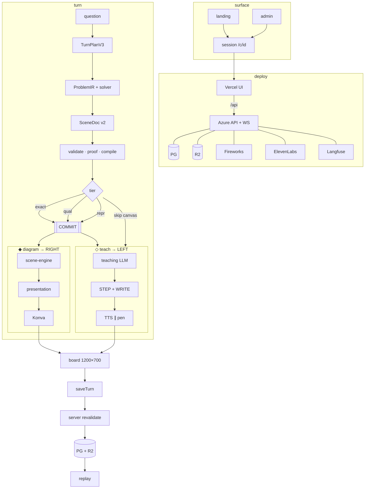

# Start

Two streams. One boundary. Diagram is compiled before speech.

Open [`architecture.excalidraw`](architecture.excalidraw) in Excalidraw (File → Open). Or paste the mermaid below: Insert → Mermaid.

## Boundary

| Stream | Owns | Never |
|---|---|---|
| ◆ `scene-engine` | geometry, topology, labels, layout, reveal | topic templates, model pixels |
| ◇ teaching | narration, work-area `WRITE`, `[FOCUS:id]` | draw / label / erase / coordinates |
| ★ solver | numbers that enter the plan | guessed scalars |

One atomic commit. Invalid or partial candidates never render. Required visual that fails both exact and source representation → empty canvas, still teach.

## Live path

1. `question` → `TurnPlanV3`
2. `ProblemIR/v1` + deterministic solver — reconcile before speech
3. `SceneDocument/v2` → validate / proof / compile / labels
4. pick one tier → `COMMIT`
5. reveal RIGHT ∥ speak+WRITE LEFT — estimated TTS schedule first
6. `saveTurn` → server recompile + exact command match → PG + R2 → replay

Done when narration starts only after a validated commit, and persisted commands match the server presentation.

## Open

| Job | File |
|---|---|
| live turn | `apps/tutor/features/tutor-session/hooks/turn/useQuestionHandler.ts` |
| scene authority | `packages/scene-engine/` |
| reveal | `apps/tutor/features/tutor-session/lib/verifiedScenePresentation.ts` |
| fallback | `apps/tutor/features/tutor-session/lib/representationFallbackV4.ts` |
| ownership filter | `packages/drawing/src/protocol/commandPlacement.ts` |
| execution guard | `apps/tutor/features/tutor-session/hooks/useCommandExecution.ts` |
| TTS + pen | `apps/tutor/features/tutor-session/hooks/turn/useSegmentRunner.ts` |
| persist trust | `apps/tutor/lib/scene/turnScenePersistence.ts` |
| LLM proxy | `apps/tutor/app/api/chat/route.ts` |
| Konva | `packages/whiteboard/src/Whiteboard.tsx` |
| admin lectures | `apps/tutor/features/admin/` |

## Next

- [architecture.md](docs/agent/architecture.md) — turn + persist rules
- [layout.md](docs/agent/layout.md) — where new files go
- [packages.md](docs/agent/packages.md) — package maps
- [backend.md](docs/agent/backend.md) — API, `lib/`, deploy env
- [tutor-sync-architecture.md](docs/architecture/tutor-sync-architecture.md) — voice ↔ WRITE
- [universal-illustration-engine-v4.md](docs/architecture/universal-illustration-engine-v4.md) — tiers + operators
- [geometry-debug.md](docs/agent/geometry-debug.md) — Langfuse trace order
