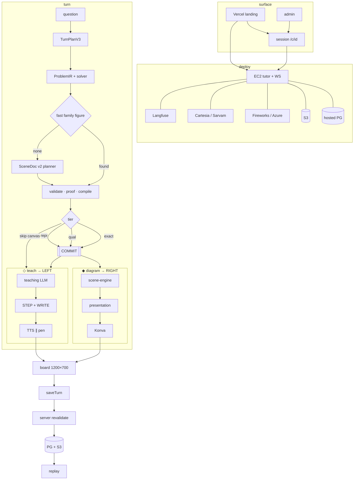

# Start

Two streams. One boundary. Diagram is compiled before speech.

The mermaid below is current. The older drawing in [`architecture.excalidraw`](architecture.excalidraw) predates Cartesia, S3 and the EC2 tutor, so trust the mermaid where they differ.

```mermaid
flowchart TB
  subgraph surface
    landing[landing]
    session["session /c/id"]
    admin[admin]
  end
  landing --> session
  admin --> session

  subgraph deploy
    landing[Vercel landing]
    ec2[EC2 tutor + WS]
    landing --> ec2
    ec2 --- pg[(hosted PG)]
    ec2 --- s3[(S3)]
    ec2 --- llm[Fireworks / Azure]
    ec2 --- tts[Cartesia / Sarvam]
    ec2 --- lf[Langfuse]
  end
  session --> ec2

  subgraph turn
    Q[question] --> Plan[TurnPlanV3]
    Plan --> IR["ProblemIR + solver"]
    IR --> Fast{fast family figure}
    Fast -->|found| Prove
    Fast -->|none| Scene[SceneDoc v2 planner]
    Scene --> Prove[validate · proof · compile]
    Prove --> Tier{tier}
    Tier -->|exact| Commit[[COMMIT]]
    Tier -->|qual| Commit
    Tier -->|repr| Commit
    Tier -->|skip canvas| Teach
    Commit --> Diagram
    Commit --> Teach
  end

  subgraph Teach["◇ teach → LEFT"]
    LLM[teaching LLM] --> Step["STEP + WRITE"]
    Step --> Pen["TTS ∥ pen"]
  end

  subgraph Diagram["◆ diagram → RIGHT"]
    SE[scene-engine] --> Pres[presentation]
    Pres --> KR[Konva]
  end

  KR --> Board["board 1200×700"]
  Pen --> Board
  Board --> Save[saveTurn]
  Save --> Trust[server revalidate]
  Trust --> Store[(PG + S3)]
  Store --> Replay[replay]
```

## Boundary

| Stream | Owns | Never |
|---|---|---|
| ◆ `scene-engine` | geometry, topology, labels, layout, reveal | topic templates, model pixels |
| ◇ teaching | narration, work-area `WRITE`, `[FOCUS:id]` | draw / label / erase / coordinates |
| ★ solver | numbers that enter the plan | guessed scalars |

One atomic commit. Invalid or partial candidates never render. Required visual that fails both exact and source representation → empty canvas, still teach.

## Live path

1. `question` → `TurnPlanV3`
2. `ProblemIR/v1` + deterministic solver — reconcile before speech
3. fast deterministic family figure, else `SceneDocument/v2` planner → validate / proof / compile / labels
4. pick one tier → `COMMIT`
5. reveal RIGHT ∥ speak+WRITE LEFT — estimated TTS schedule first
6. `saveTurn` → server recompile + exact command match → PG + S3 → replay

Done when narration starts only after a validated commit, and persisted commands match the server presentation.

## Open

| Job | File |
|---|---|
| live turn | `apps/tutor/features/tutor-session/hooks/turn/useQuestionHandler.ts` |
| scene authority | `packages/scene-engine/` |
| reveal | `apps/tutor/features/tutor-session/lib/scene/verifiedScenePresentation.ts` |
| fallback | `apps/tutor/features/tutor-session/lib/scene/representationFallback.ts` |
| ownership filter | `packages/drawing/src/protocol/commandPlacement.ts` |
| execution guard | `apps/tutor/features/tutor-session/hooks/useCommandExecution.ts` |
| TTS + pen | `apps/tutor/features/tutor-session/hooks/turn/useSegmentRunner.ts` |
| persist trust | `apps/tutor/lib/scene/turnScenePersistence.ts` |
| LLM proxy | `apps/tutor/app/api/chat/route.ts` |
| Konva | `packages/whiteboard/src/Whiteboard.tsx` |
| admin panel (overview, users, logs, fails) | `apps/tutor/features/admin/` + `apps/tutor/lib/admin/` |
| admin lectures | `apps/tutor/features/admin/` |

## Next

- [architecture.md](docs/agent/architecture.md) — turn + persist rules
- [layout.md](docs/agent/layout.md) — where new files go
- [packages.md](docs/agent/packages.md) — package maps
- [backend.md](docs/agent/backend.md) — API, `lib/`, deploy env
- [tutor-sync-architecture.md](docs/architecture/tutor-sync-architecture.md) — voice ↔ WRITE
- [speech-providers.md](docs/architecture/speech-providers.md): Cartesia, Sarvam, ElevenLabs
- [diagram-accuracy-architecture.md](docs/architecture/diagram-accuracy-architecture.md): tiers, operators, adding coverage
- [geometry-debug.md](docs/agent/geometry-debug.md) — Langfuse trace order
